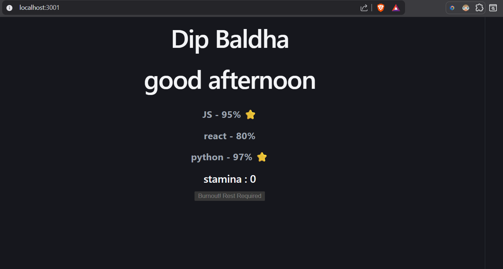

# 📑 Daily Task Submission Report
**MERN Stack Internship | Prelytix Private Limited**

| Field | Details |
| :--- | :--- |
| **Student Name** | [Baldha Dip Ketanbhai] |
| **Internship ID** | [PRL-MERN-2026-XXXX] |
| **Date** | [2026-05-12] |
| **Course Day** | [Day - 1] |
| **GitHub Repo** | [https://github.com/DB1132/1-month-Internship] |

---

## 🎯 Daily Objective
*Briefly describe what you aimed to achieve today.*
> Today, I learned the fundamentals of React Props and State management, including how state works and updates dynamically. I also practiced passing arrays as props between components and configuring a custom port number in a Vite React project.

---

## 🛠️ Implementation & Changes (Self-Documentation)
*Today, I implemented multiple React concepts and practiced component-based architecture. I learned how event handling works using the onClick function and how React state updates dynamically with useState.

I also implemented logic using the Modulus (%) operator to track every 5th click and apply different behavior based on conditions. Additionally, I practiced conditional rendering in React using expressions like:
                            {level >= 90 && "⭐"}
This is called Conditional Rendering using the Logical AND (&&) Operator. It renders the star icon only when the condition is true.
*

### 1. New Features / Logic Implemented
- **What:** Implemented dynamic greeting functionality, reusable React components, props handling, and state-based stamina logic.
- **How:** Created separate components like Header, SkillList, and SkillBadge to improve modularity. Used useState for managing stamina updates and implemented conditional logic using the Modulus (%) operator to trigger special stamina reduction every 5th click. Also used conditional rendering with the && operator to display a ⭐ icon for skills with a level above 90.
- **Why:** To understand React component communication, dynamic UI updates, event handling, conditional rendering, and non-linear state management in real-world scenarios.

---

## 💻 Code Snippet: My Primary Contribution
*Share a critical piece of code or a logic change you implemented today.*

```javascript
    function clickhandle() {
        const newclick = clickcount + 1;
        setClickcount(newclick);

        let damage = 2;
        if (newclick % 5 === 0) {
        damage = 15;
        }

        let newstamina = stamina - damage;

        if (newstamina < 0) {
        stamina = 0;
        }

        setStamina(newstamina);
  }

  function SkillBadge({ name, level }){

    return(
        <div><h3>
        {name} - {level}%
        {level >= 90 && " ⭐"} 
        </h3></div>
    )
}
```

---

## 📸 Screenshots / Proof of Work
*Insert screenshots of your UI, API responses (Postman), or Console logs.*

> **UI Screenshot:**
> 

---

## 🛑 Challenges Faced & Solutions
*Describe any bugs or blockers you encountered and how you solved them.*

- **Problem:** [Faced issues while importing and rendering React components because of incorrect component naming and file paths. The component was written in lowercase (header) which React treated as an HTML tag instead of a custom component]
- **Solution:** [Renamed the component to Header, corrected the import path, and rendered it using <Header /> following React component naming conventions.]

- **Problem:** [The stamina value was going below 0 after multiple button clicks.]
- **Solution:** [Added conditional logic to check the updated stamina value and set it to 0 if it became negative, ensuring proper UI behavior and preventing invalid state updates.]

- **Problem:** [Environment variable changes were not reflecting in the application immediately.]
- **Solution:** [Restarted the Vite development server using npm run dev because Vite reloads .env variables only after restarting the server.]


---

## 💡 Key Learnings
*What was the most important takeaway from today's session?*

- Learned how React state works using useState and how UI updates dynamically based on state changes.
- Understood how to pass arrays as props between components and render data dynamically using the .map() method.
- Learned conditional rendering techniques in React using the && operator.
- Practiced using the Modulus (%) operator to implement custom logic such as triggering actions on every 5th click.
- Understood the importance of reusable components and proper component structure in React  applications.

---

 **i Explain in 2 sentences how the Virtual DOM handles your Stamina updates.**
    The Virtual DOM efficiently updates only the parts of the UI that change instead of reloading the entire page. In the stamina task, when the state updates after each button click, React compares the new Virtual DOM with the previous one and updates only the stamina text and button state in the real DOM.

 **ii Provide a snippet of your Modulus logic for the 5th-click bug.**
```javascript
     if (newclick % 5 === 0) {
      damage = 15;
    }
```
 **iii List 3 differences between Vite and Create React App (CRA).**

 | Vite                                | Create React App (CRA)        |
| ----------------------------------- | ----------------------------- |
| Faster development server startup   | Slower startup time           |
| Uses native ES Modules              | Uses Webpack bundling         |
| Faster Hot Module Replacement (HMR) | Slower refresh during changes |
| Lightweight and modern tooling      | Heavier configuration         |
| Easier and faster build process     | Comparatively slower builds   |


---
**Signature:**  
*Dip Baldha*
